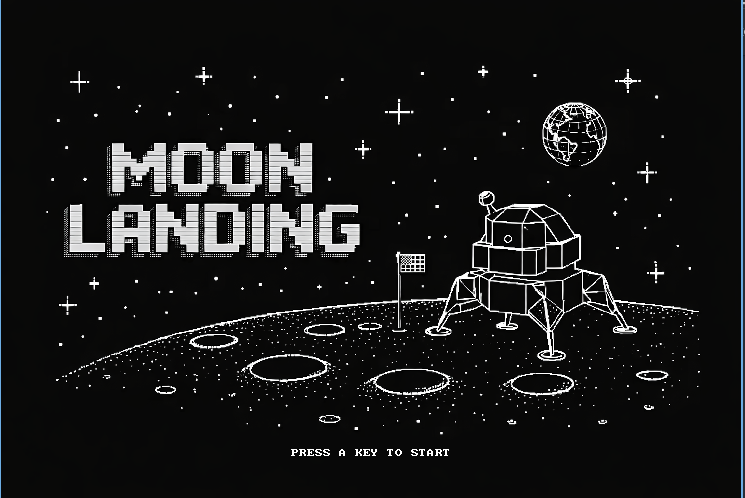
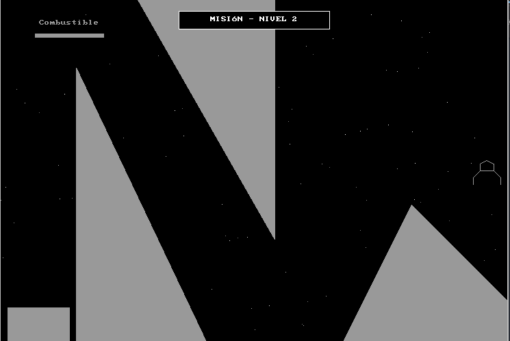

# 🌙 MoonLanding

A retro lunar lander game built in C++ with Allegro 4, based on the tutorials by [Deivid Coptero](https://www.youtube.com/@deividcoptero) and expanded with additional levels, mechanics, and polish.

---

## About

The goal is simple: pilot a spacecraft through obstacles and land it on a small platform without crashing. The game has 10 levels with progressively harder layouts.

Everything is drawn with Allegro's primitive functions — lines, rectangles, circles, and triangles. No sprites, no external assets for the game itself.

---

## Features

- 10 handcrafted levels with different obstacle types
- Newtonian physics — constant gravity, directional thrusters, velocity cap
- Geometric collision detection built from scratch (triangles, rectangles, circles)
- Static and moving circles with gravitational fields that pull the ship
- Procedural explosion animation using rotating line segments
- Reactive engine audio — sound turns on and off with thruster input
- Fuel system — using multiple thrusters drains fuel faster
- Animated starfield background
- Victory and game over screens
- 60 FPS game loop using Allegro's hardware timer
- More polished hitbox with five rectangles instead of tree
- polished the colisions with the base.
- Binary under 100 KB

---

## Controls

| Key | Action |
|-----|--------|
| `↑` | Main thruster |
| `←` | Left thruster |
| `→` | Right thruster |
| `A` | Confirm / Retry |
| `ESC` | Exit |

---

## Levels

| Level | Obstacles |
|-------|-----------|
| 1 | Open space, just gravity |
| 2–3 | Floor and ceiling triangles |
| 4–6 | More triangles, tighter gaps |
| 7 | Triangles + falling rocks |
| 8 | Large rectangular blocks |
| 9 | Static circles with gravity fields |
| 10 | Moving circles with orbits |

---

## Physics

```
gravity      = 0.05 per frame (downward)
thrust force = 0.09 per thruster
max speed    = ±4.0 (both axes)
```

Landing is valid only when vertical speed `vy < 1.0`. Higher speed triggers an explosion.

---

## Collision Detection

- **Triangles** — point-in-triangle test using cross products, plus segment-segment intersection
- **Circles** — segment vs circle using the quadratic formula
- **Gravity fields** — directional force applied when the ship enters a circle's radius of influence, scaled by distance

---

## Building

A Nix flake is included for a reproducible development environment with Allegro 4.

```bash
# Enter dev environment
nix develop

# Compile
g++ moonlanding.cpp $(pkg-config --cflags --libs allegro) -lm -o moonlanding

# Run
./moonlanding
```

A pre-compiled binary for Linux is also included.

---

## Project Structure

```
moonlanding/
├── moonlanding.cpp       # Full source (single file)
├── moonlanding           # Pre-compiled Linux binary
├── flake.nix             # Nix dev environment
├── splash_nix.bmp        # Intro screen
├── victoria_art.bmp      # Victory screen
├── pdpsong.wav           # Intro music (PDP-1, 1962)
├── gamesong.wav          # Background music
├── thrust.wav            # Engine sound
├── boom.wav              # Explosion sound
├── sonidostart.wav       # Start sound
└── victory_fixed.wav     # Victory music
```

---

## Intro Music

The intro track is a piece performed by a **PDP-1 at MIT in 1962**, using the **Harmony Compiler** written by Peter Samson — one of the earliest programs to produce polyphonic music on a digital computer.

---

## Details

| | |
|--|--|
| Language | C++ |
| Library | Allegro 4 |
| Resolution | 740 × 500 px |
| Target FPS | 60 |
| Binary size | < 100 KB |
| Platform | Linux / NixOS |
| Rendering | Software, double-buffered |

---

## 📸 Screenshots





