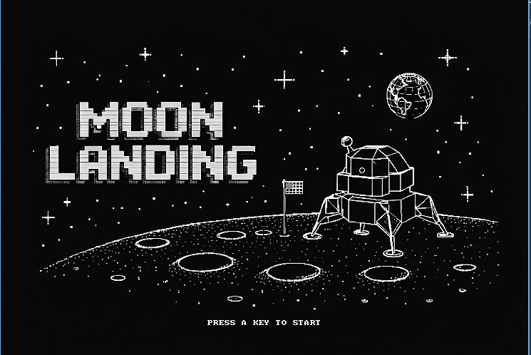

# 🌙 MoonLanding

A retro lunar lander game built in C++ with Allegro 4, ported to Allegro 5 with native desktop and web (WebAssembly) support. Based on the tutorials by [Deivid Coptero](https://www.youtube.com/@deividcoptero) and expanded with additional levels, mechanics, and polish.

🎮 **[Play in your browser](https://alavaelian.github.io/MoonLanding/)** *(coming soon)*

---

## About

The goal is simple: pilot a spacecraft through obstacles and land it on a small platform without crashing. The game has 10 levels with progressively harder layouts.

Everything is drawn with primitive functions — lines, rectangles, circles, and triangles. No sprites, no external assets for the game itself.

---

## Features

- 10 handcrafted levels with different obstacle types
- Newtonian physics — constant gravity, directional thrusters, velocity cap
- Geometric collision detection built from scratch (triangles, rectangles, circles)
- Static and moving circles with gravitational fields that pull the ship
- Procedural explosion animation using rotating line segments
- Reactive engine audio — sound turns on and off with thruster input
- Fuel system — using multiple thrusters drains fuel faster, blinking warning below 18%
- Animated starfield background
- Resolution scaling via Allegro 5 transformations (maintains 740×500 aspect ratio)
- Retro terminal-style frame around the viewport
- Victory and game over screens
- State machine architecture (compatible with emscripten main loop)
- Web Audio API integration for browser version
- 60 FPS game loop
- More polished hitbox with five rectangles instead of three
- Binary under 100 KB (native)

---

## Controls

| Key | Action |
|-----|--------|
| `↑` | Main thruster |
| `←` | Left thruster |
| `→` | Right thruster |
| `A` | Confirm / Retry |
| `ESC` | Exit |

---

## Levels

| Level | Obstacles |
|-------|-----------|
| 1 | Open space, just gravity |
| 2–3 | Floor and ceiling triangles |
| 4–6 | More triangles, tighter gaps |
| 7 | Triangles + falling rocks |
| 8 | Large rectangular blocks (tunnel) |
| 9 | Static circles with gravity fields |
| 10 | Moving circles with gravitational orbits |

---

## Physics

```
gravity      = 0.05 per frame (downward)
thrust force = 0.09 per thruster
max speed    = ±4.0 (both axes)
```

Landing is valid only when vertical speed `vy < 1.0`. Higher speed triggers an explosion.

---

## Collision Detection

- **Triangles** — point-in-triangle test using cross products, plus segment-segment intersection
- **Circles** — segment vs circle using the quadratic formula
- **Gravity fields** — directional force applied when the ship enters a circle's radius of influence, scaled by distance

---

## Port History

### Original: Allegro 4 (`moonlanding.cpp`)

The game was originally written with the Allegro 4 API using a classic while-loop architecture, `key[]` array for keyboard input, `BITMAP*` for double-buffered rendering, and `play_sample()` for audio.

### Port: Allegro 5 (`main_a5.cpp`)

The game was rewritten with the Allegro 5 API, implementing:

- **State machine**: `CLICK_TO_START` → `SPLASH_ESPERA` → `LIMPIEZA` → `JUGANDO` → `NIVEL_COMPLETADO` / `EXPLOSION` / `VICTORIA`
- **Drawing API**: `al_draw_line()`, `al_draw_filled_triangle()`, `al_draw_text()`, etc.
- **Keyboard polling**: `al_get_keyboard_state()` + `al_key_down()` each frame
- **Audio**: `ALLEGRO_SAMPLE` + `al_play_sample()` / `al_stop_sample()`
- **Scaling**: `al_scale_transform()` + `al_translate_transform()` for resolution-independent rendering

### Web: Emscripten + WebAssembly

Allegro 5 was compiled from source for emscripten using the SDL2 backend (`ALLEGRO_SDL=ON`). Challenges resolved:

- **Audio**: The `allegro_audio` addon doesn't compile for emscripten/SDL. Disabled and replaced with **Web Audio API** via `--js-library audio.js`
- **WebGL**: Requires WebGL 2 (`MIN_WEBGL_VERSION=2`) for Allegro 5's renderer
- **AudioContext**: Browsers block auto-play. Added a "Click to Start" screen that initializes the AudioContext on first user gesture
- **NixOS**: Emscripten cache must point to a writable directory (`EM_CACHE=$HOME/.emscripten_cache`)

---

## Building

### Requirements

- GCC/G++ and pkg-config
- Allegro 5 (with addons: primitives, font, audio, acodec, image)
- For web: Emscripten 3.1.47, CMake, Node.js

A Nix flake is included for a reproducible development environment:

```bash
nix develop
```

### Native (Allegro 4 — original)

```bash
g++ moonlanding.cpp $(pkg-config --cflags --libs allegro) -lm -o moonlanding
./moonlanding
```

### Native (Allegro 5 — port)

```bash
g++ main_a5.cpp -o moonlanding_a5 \
    $(pkg-config --cflags --libs allegro-5 allegro_primitives-5 \
    allegro_font-5 allegro_audio-5 allegro_acodec-5 allegro_image-5) -lm
./moonlanding_a5
```

### Web (Emscripten)

**1. Set up emscripten cache (NixOS):**

```bash
export EM_CACHE=$HOME/.emscripten_cache
mkdir -p $EM_CACHE
```

**2. Build Allegro 5 for emscripten:**

```bash
git clone https://github.com/liballeg/allegro5.git
cd allegro5 && git checkout master
mkdir build_em && cd build_em
emcmake cmake .. \
    -DCMAKE_BUILD_TYPE=Release \
    -DALLEGRO_SDL=ON \
    -DCMAKE_C_FLAGS="-s USE_SDL=2 -msimd128" \
    -DCMAKE_CXX_FLAGS="-s USE_SDL=2 -msimd128" \
    -DWANT_EXAMPLES=OFF -DWANT_TESTS=OFF \
    -DWANT_DEMO=OFF -DWANT_DOCS=OFF -DWANT_AUDIO=OFF \
    -DCMAKE_THREAD_LIBS_INIT="" \
    -DCMAKE_HAVE_THREADS_LIBRARY=1 \
    -DCMAKE_USE_PTHREADS_INIT=1 \
    -DTHREADS_PREFER_PTHREAD_FLAG=OFF \
    -DSDL2_INCLUDE_DIR="$EM_CACHE/sysroot/include" \
    -DSDL2_LIBRARY="-s USE_SDL=2"
emmake make -j$(nproc)
```

**3. Build the game:**

```bash
emcc main_a5.cpp -o moonlanding.html \
    --shell-file shell.html \
    -I ../allegro5/include \
    -I ../allegro5/build_em/include \
    -I ../allegro5/addons/primitives \
    -I ../allegro5/addons/font \
    -I ../allegro5/addons/image \
    -I ../allegro5/addons/main \
    -L ../allegro5/build_em/lib \
    -lallegro_primitives -lallegro_font -lallegro_image \
    -lallegro_main -lallegro \
    --js-library audio.js \
    -s USE_SDL=2 -msimd128 \
    -s ALLOW_MEMORY_GROWTH=1 \
    -s MIN_WEBGL_VERSION=2 -s MAX_WEBGL_VERSION=2 \
    -s FULL_ES3=1 \
    --preload-file splash_nix.bmp \
    --preload-file victoria_art.bmp \
    --preload-file pdpsong.wav \
    --preload-file sonidostart.wav \
    --preload-file thrust.wav \
    --preload-file boom.wav \
    --preload-file gamesong.wav \
    --preload-file victory_fixed.wav
```

**4. Serve locally:**

```bash
npx serve .
# Open http://localhost:3000/moonlanding.html
```

---

## Project Structure

```
moonlanding/
├── moonlanding.cpp       # Original Allegro 4 source (10 levels)
├── main_a5.cpp           # Allegro 5 port (native + web)
├── audio.js              # Web Audio API library for emscripten
├── shell.html            # Custom HTML template for web version
├── flake.nix             # Nix dev environment
├── .gitignore
├── README.md
│
├── splash_nix.bmp        # Intro screen artwork
├── victoria_art.bmp      # Victory screen artwork
├── pdpsong.wav           # Intro music (PDP-1, MIT 1962)
├── gamesong.wav          # Background music
├── sonidostart.wav       # Level start sound
├── thrust.wav            # Engine sound
├── boom.wav              # Explosion sound
├── victory_fixed.wav     # Victory music
└── assets/
    └── screenshot.png    # Screenshots
```

---

## Intro Music

The intro track is a piece performed by a **PDP-1 at MIT in 1962**, using the **Harmony Compiler** written by Peter Samson — one of the earliest programs to produce polyphonic music on a digital computer.

---

## Details

| | |
|--|--|
| Language | C++ |
| Libraries | Allegro 4 (original), Allegro 5 (port) |
| Web stack | Emscripten, WebAssembly, SDL2, Web Audio API |
| Resolution | 740 × 500 px (scales to any display) |
| Target FPS | 60 |
| Binary size | < 100 KB (native) |
| Platform | Linux / NixOS / Web |
| Rendering | OpenGL (native), WebGL 2 (web) |

---

## Screenshots



---

## License

GPL-3.0
